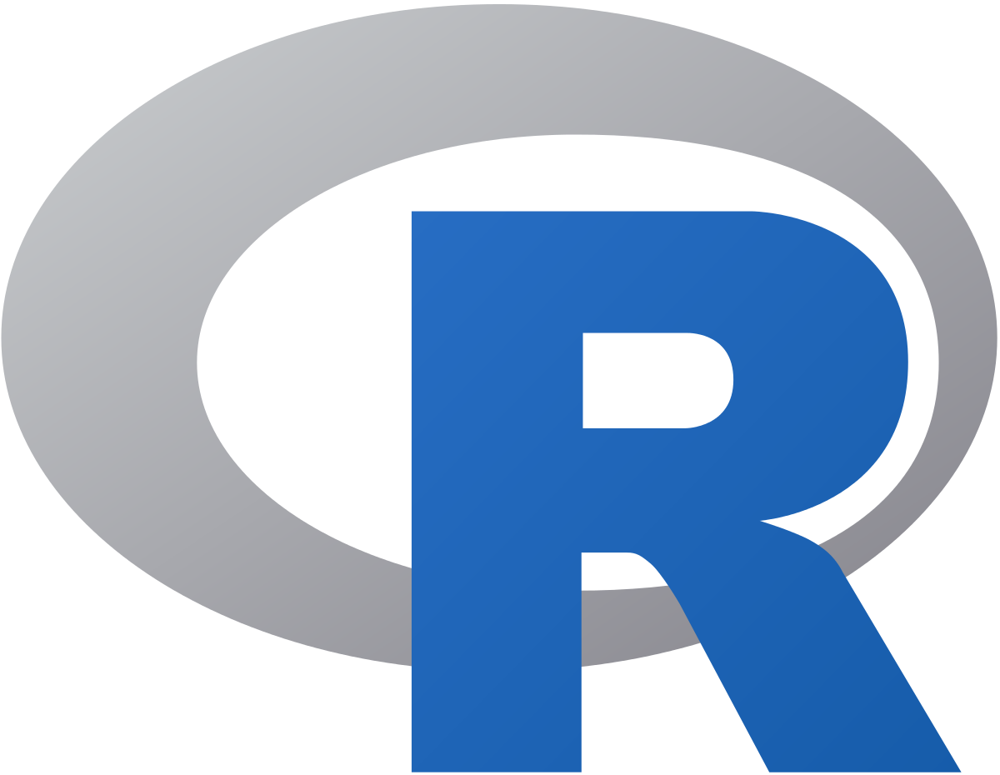
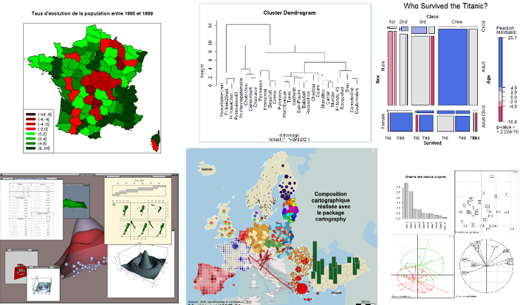

# R, son écosystème et ses possibilités

```{r gen_1, echo=FALSE, results='hide', message=FALSE, warning=FALSE}
library(tidyverse)
library(sf)
library(COGiter)
```

## Le groupe de référents R du pôle ministériel

```{r collecte prez ref, warning=FALSE, echo=FALSE, results='asis'}
# Utilisation du chapitre de présentation des référents présent dans https://github.com/MTES-MCT/parcours-r
a <- knitr::knit_child(text = stringi::stri_read_lines("https://raw.githubusercontent.com/MTES-MCT/parcours-r/master/parties_communes/les_referents_R.Rmd", encoding = "UTF-8"), quiet = TRUE)
cat(a, sep = '\n')
```


## R c'est quoi ?

{width=50px}

- Un langage de programmation interprété exécutable pas à pas $\rightarrow$ lignes de code
- Un logiciel interactif permettant de traiter divers types de données 


## Un peu d'histoire

- À l'origine existait le langage S, servant à programmer avec des données (*Bell laboratory*, années 70)

- Au milieu des années 90, mélange de S et du langage Lisp pour le dédier à l'analyse de données et aux graphiques $\rightarrow$ création de R. [Ihaka R, Gentleman R (1996) R: A Language for Data Analysis and Graphics. *Journal of
Computational and Graphical Statistics*, 5(3), 299–314](https://www.stat.auckland.ac.nz/~ihaka/downloads/R-paper.pdf)

- S'est d'abord développé dans le monde académique, puis a essaimé vers d'autres domaines professionnels, voire associatifs

- Système toujours d’actualité - Mise à jour tous les 6 mois

- Avenir dans la statistique publique : adopté comme standard par l'Insee (à l'horizon 2025) et divers SSM. 

- Des packages pour :
    - charger les données produites par l'Insee au format sdmx,
    - charger les formats des organisations internationales (Eurostat, OCDE, ONU, etc.),
    - charger des couches spatiales shp, flux ou autres,
    - charger le cadastre au format EDIGEO, ...
    - interroger facilement des API,  
    - interagir avec des bases de données, 
    - charger des fonds de cartes,    
    - réaliser des publications conformes à la charte graphique de l'Etat,   
    - gérer les millésimes du référentiel communal, etc.

## Un logiciel libre

- Disponible en libre téléchargement sur [le site officiel du CRAN = Comprehensive R Archive Network](https://cran.r-project.org)
C'est le site de référence pour R. Il contient non seulement les installeurs du logiciel mais également de nombreuses ressources : documentations, FAQ, tutoriels...
- Installable sur la plupart des systèmes d'exploitation
- Utilisé en recherche, en enseignement et en entreprise
- Une communauté très active :
    - Forum des [utilisateurs de R en français](http://forums.cirad.fr/logiciel-R/)
    - Communauté française des utilisateurs de R (avec des packages spécifiques, qui permettent de gérer les changements de géographie communale par exemple) : [Frrrenchies](https://github.com/frrrenchies/frrrenchies)
    - Slack de ces utilisateurs (pour les questions/réponses, actualités...) [Slack](https://r-grrr.slack.com/)
    - R-bloggers : https://www.r-bloggers.com/
    - Stackoverflow : https://stackoverflow.com/questions/tagged/r
  
C'est un logiciel libre : les utilisateurs ont la liberté d'exécuter, copier, distribuer, étudier, modifier et améliorer ce logiciel. R fait partie de la "galaxie" GNU (GNU's Not Unix). R est donc libre, gratuit et multi-plateformes.
    
## Que peut-on faire avec R ?

- Lire des données de formats divers, les convertir
- Les manipuler (prétraitements)
- Les enrichir à partir de données externes
- Les analyser, les modéliser, 
- Présenter les résultats (tableaux, graphiques, cartes)
- Publier...

... et ce au moyen d'une palette de méthodes extrêmement diversifiées.

Privilégie la flexibilité et le découpage des traitements en parties simples.




## Un logiciel modulaire

- Le package `base` contient nombreuses fonctionnalités
- Extensible au moyen de **packages** (1 package = 1 ensemble de nouvelles fonctions) 
- Nombreuses extensions spécialisées

De base, R permet déjà de faire un très grand nombre de choses avec son socle commun : le package `base`. Pour afficher la liste des fonctions disponibles dans le package `base` :

```{r gen_2, eval = F}
library(help = 'base')
```

Sur ce package `base` vient se greffer un ensemble de packages (plugins, modules, librairies, extensions) complémentaires.
Un package est une bibliothèque de fonctions. La plupart de ceux qui font référence sont mis à disposition de tous sur le dépôt CRAN.

Cela permet d'étendre à l'infini les possibilités de R : celles-ci sont seulement limitées par la volonté de développement (et de maintien) des utilisateurs.

De même que les packages sont dépendants de fonctions du module principal `base`, certains packages peuvent être dépendants de fonctionnalités d'autres packages $\rightarrow$ notion d'arbre des dépendances (géré par R de façon transparente).

Structure modulaire $\rightarrow$ il existe de multiples façons d'effectuer une même tâche. Il suffit d'une méthode maîtrisée pour aller au résultat.

Les fonctionnalités utilisables dans R, sont en perpétuelle évolution et permettent d'intégrer les méthodes les plus récentes dans des domaines qui évoluent rapidement : modélisation, analyse spatiale, dataviz,...

Le groupe des référents R propose un tutoriel d'installation et de configuration de R sur https://github.com/MTES-MCT/parcours-r/wiki/Installation-de-R-et-RStudio-Desktop-au-MTE.

## Des exemples de ce qu'on peut faire avec R :

- Le support de cette formation
- Les [publications régionales sur le parc locatif social](https://dreal.statistiques.developpement-durable.gouv.fr/parc_social/2021/)
- [Visualisation du compte du logement](http://dataviz.statistiques.developpement-durable.gouv.fr/csl2017/)
- [Les pesticides dans les cours d'eau des Pays de la Loire](https://ssm-ecologie.shinyapps.io/qualite-des-eaux/)
- [Des exemples de ce qu'on peut faire avec shiny](http://shiny.rstudio.com/)
