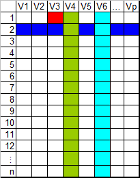
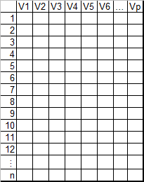

# Mon premier jeu de données

## Les types de valeurs dans R

Une valeur constitue l'unité de base des données pour R. Comme pour la plupart des logiciels, elles peuvent être de trois **types** :

- **Numérique** : entier, double
- **Caractère** : texte ou code
- **Logique** : booléens

*En anglais : numeric, character et logical !*

Les formats de dates sont de type character.

## Les vecteurs

Les valeurs peuvent être structurées au sein de vecteurs. 
Ces vecteurs peuvent être vus comme des colonnes de valeurs toutes du même type.

Différentes fonctions permettent de créer des vecteurs.

```{r premierJeuDonnees}
vect_num <- c(1, 160, 2, 9)

vect_txt <- c("Je", "programme", "en", "R")

sequence <- seq(from = 1, to = 10, by = 1)
sequence_pareille <- 1:10

repetition <- rep("bla", 3)

```

## Les dataframes

Plusieurs vecteurs de types différents possédant un même nombre de lignes peuvent être accolés pour former une **dataframe**.
Les dataframes sont les objets les plus courants dans le traitement de données usuel.
Il s'agit de tableaux dont les lignes correspondent à des observations et les colonnes à des variables.

Ces dataframes peuvent être créées par association des vecteurs avec les fonctions :
```{r}
dataframe_a <- data.frame(vect_num, vect_txt)

dataframe_b <- bind_cols("vect_num" = vect_num, "vect_txt" = vect_txt)
```

Une dataframe peut aussi être créée par l'import d'un tableau, voir le chapitre dédié.


Il est possible d'accéder aux éléments d’une dataframe à partir du numéro de ligne et de colonne, grâce aux crochets :

<center></center>

- `base[1,3]` $\rightarrow$ <span style="color:red">valeur de la première ligne et de la troisième colonne </span>
- `base[2,]` $\rightarrow$ <span style="color:blue">toutes les variables pour la 2e observation</span>
- `base[,4]` $\rightarrow$ <span style="color:green">toutes les observations de la quatrième colonne  </span>
- `base[,’V6’]` $\rightarrow$ <span style="color:cyan">toutes les observations de la variable V6</span>
- $\Rightarrow$ Utile pour sélectionner une partie d'une table : `base[1:4, c(3, 6)]`


## Les fonctions et les valeurs particulières
- NA : valeur manquante (*Not Available*) dans une dataframe ou en résultat d'une fonction
- NaN : pas un nombre (*Not a Number*) lorsqu'une fonction tente de diviser par 0
- -Inf, Inf : infini positif ou négatif lorsque une fonction diverge

Une valeur manquante peut perturber l’exécution d'une fonction :
```{r}
V1 <- c(1, 14, NA, 32.7)
mean(V1)              # renvoie NA. Not good !
mean(V1, na.rm = TRUE)   # renvoie 15.9   - OK !
```

Les noms de ces valeurs particulières sont "réservés" par R, ils ne peuvent pas être utilisés comme nom de variable.
C'est également le cas des booléens (`TRUE`, `FALSE`, `T` et `F`)

$\Rightarrow$ Le [module 2 "Préparation des données"](https://mtes-mct.github.io/parcours_r_socle_preparation_des_donnees/) aborde la gestion de ces valeurs particulières.

## Importation de données 

Conseil : exporter les données au format CSV ; c'est le format le plus interopérable (supporté par tous les logiciels stat). Utiliser ensuite la fonction `read.csv` après avoir défini le répertoire de travail (ou en donnant le chemin complet)

```{r lecturecsv}
base0 <- read.csv(file = "extdata/Base_synth_territoires.csv", fileEncoding = 'latin1',
                  header = TRUE,
                  sep = ";",
                  dec = ",")
```

- `header =`indique la présence des noms de variable sur la première ligne
- `sep =` indique le séparateur de champ : ';' '/t' pour tabulation
- `dec =` indique le séparateur de décimale ('.' par défaut)
- `colClasses =`permet de préciser le type de chaque colonne de la donnée en entrée, par exemple pour une table de 3 colonnes de types texte, puis 2 fois numériques : `colClasses = c("character", "numeric", "numeric")`. `NA` pour laisser R deviner, `"NULL"` pour éviter d'importer la colonne.

$\Rightarrow$ `?read.csv` pour plus d'options

Autres façons d'importer les données

- Fonction `read_delim`, du package `readr`, plus rapide
- Fonction `fread`, du package `data.table`, beaucoup plus rapide !!
- Pour importer les fichiers XLS, ODS, SHP ou DBF, il existe des fonctions et des packages spécifiques
- **Le passage par un fichier csv est très recommandé**.

Note : le [format parquet](https://arrow.apache.org/docs/r/reference/read_parquet.html) est très intéressant pour des tables de plusieurs centaines de milliers de lignes.


## Gérer le type des variables
Chaque variable est du type de son contenu (numeric, character, logical). 
Si les valeurs prises par la variables correspondent à un nombre fini de modalités, **la variable peut être du type "factor"**. 
Ses composantes sont toujours d'un des 3 types décrits ci-dessus mais il est possible d'employer des fonctions spécifiques au traitement de modalités.
À chaque type de variable correspond une utilisation. 
Lors de l’import des données, un type est affecté automatiquement par R.
Mais le type peut être erroné. 
Il suffit alors de les convertir :

```{r converttype}
base <- mutate(base0, LIBGEO = as.character(LIBGEO))

```

ou `as.factor()`, `as.numeric()`, etc...

Pour être sûr de ne pas faire de bêtise, il vaut mieux gérer les types au moment de l'importation avec le paramètre `colClasses` $\rightarrow$ exercice !


## Structure des données : le *dataframe*

<center></center>

- n lignes (observations)
- p colonnes (variables)

Les fonctions suivantes permettent de connaître la structure de la dataframe, d'en connaître les variables, d'en observer certaines lignes ou d'en vérifier le type.

```{r dimdf}
nrow(base) # nombre de lignes
ncol(base) # nombre de colonnes
dim(base) # nombre de lignes et de colonnes
names(base) # noms des variables
str(base) # nom, type et extrait des variables
head(base) # 6 premières lignes
tail(base) # 6 dernières lignes
class(base) # la classe de l'objet (du point de vue langage orienté objet)
typeof(base) # le type d'objet du point de vue "interne" à R

```


## Exercice 2 : importer des données et premier coup d'oeil

On peut importer n'importe quel format de données en R (Excel, SAT, Stata, SQL...). Beaucoup sont abordés lors du [module 2 "Préparation des données"](https://mtes-mct.github.io/parcours_r_socle_preparation_des_donnees/). Pour ce module, nous ne voyons que l'importation de fichier `.CSV`. Si vous avez une base de données en Excel ou LibreOffice Calc, sauvegardez l'onglet que vous souhaitez en faisant "enregistrer sous" $\rightarrow$ "délimité CSV". 

Ici, nous travaillerons sur une base de données communales fournie par l'Insee, dite "comparateur de territoires".

```{r mod1_exo2, child=charge_exo("m1", "exo2.rmd"), echo=FALSE}

```


## Catalogue d'attributs de la base  


- *CODGEO* : [text] Code du département suivi du numéro de commune ou du numéro d'arrondissement municipal
- *LIBGEO* : [text] Libellé de la commune ou de l'arrondissement municipal pour Paris
- *REG*: [text] Région
- *DEP* : [text] Département
- *ZAU* : [text] Zonage en aire urbaine
- *ZE* : [text] Zone d'emploi
- *P14_POP*: [double] Population en 2014
- *P09_POP*: [double] Population en 2009
- *SUPERF*: [double] Superficie (en km2)
- *NAIS0914*: [double] Nombre de naissances entre le 01/01/2009 et le 01/01/2014
- *DECE0914*: [double] Nombre de décès entre le 01/01/2009 et le 01/01/2014
- *P14_MEN*: [double] Nombre de ménages en 2014
- *NAISD15*: [double] Nombre de naissances domiciliées en 2015
- *DECESD15*: [double] Nombre de décès domiciliés en 2015
- *P14_LOG*: [double] Nombre de logements en 2014
- *P14_RP*: [double] Nombre de résidences principales en 2014
- *P14_RSECOCC*: [double] Nombre de résidences secondaires et logements occasionnels en 2014
- *P14_LOGVAC*: [double] Nombre de logements vacants en 2014
- *P14_RP_PROP*: [double] Nombre de résidences principales occupées par propriétaires en 2014
- *NBMENFISC13*: [double] Nombre de ménages fiscaux en 2013
- *PIMP13*: [text] Part des ménages fiscaux imposés en 2013
- *MED13*: [double] Médiane du niveau de vie en 2013
- *TP6013*: [text] Taux de pauvreté en 2013
- *P14_EMPLT*: [double] Nombre d'emplois au lieu de travail en 2014
- *P14_EMPLT_SAL*: [double] Nombre d'emplois salariés au lieu de travail en 2014
- *P09_EMPLT*: [double] Nombre d'emplois au lieu de travail en 2009
- *P14_POP1564*: [double] Nombre de personnes de 15 à 64 ans en 2014
- *P14_CHOM1564*: [double] Nombre de chômeurs de 15 à 64 ans en 2014
- *P14_ACT1564*: [double] Nombre de personnes actives de 15 à 64 ans en 2014
- *ETTOT14*: [double] Total des établissements actifs au 31 décembre 2014
- *ETAZ14*: [double] Etablissements actifs de l'agriculture, sylviculture et pêche au 31/12/2014
- *ETBE14*: [double] Etablissements actifs de l'industrie au 31/12/2014
- *ETFZ14*: [double] Etablissements actifs de la construction au 31/12/2014
- *ETGU14*: [double] Etablissements actifs du commerce, transports et services divers au 31/12/2014
- *ETGZ14*: [double] Etablissements actifs du commerce et réparation automobile au 31/12/2014
- *ETOQ14*: [double] Etablissements actifs de l'administration publique, enseignement, santé et action sociale au 31/12/2014
- *ETTEF114*: [double] Etablissements actifs de 1 à 9 salariés au 31 décembre 2014
- *ETTEFP1014*: [double] Etablissements actifs de 10 salariés ou plus au 31 décembre 2014


