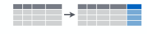

# Première manipulation des données

```{r}
library("dplyr")
```

## Afficher les valeurs et manipuler les variables

- Pour afficher la table, plusieurs façons : "clic" dans l'environnement Rstudio, `View(base)`, `print(base)`, `base`.

- Pour accéder à une variable : fonction `pull()`

Par exemple :
```{r}
str(pull(base, DEP))
```

## Créer de nouvelles variables

<center></center>

La fonction `mutate()` permet de créer/modifier une variable (ou plusieurs).

```{r, eval = FALSE}
TableEnSortie <- mutate(TableEnEntree,
                        NouvelleVariable = DefinitionDeLaVariable)
```
Par exemple :
```{r}
base <- mutate(base, log_SUPERF = log(SUPERF))
```

Nb : `mutate()` permet également de modifier une variable. Dans ce cas la syntaxe est la même que ci-dessus, mais les noms d'entrée et de sortie sont les mêmes :

```{r}
base <- mutate(base, log_SUPERF = 100 * log_SUPERF)
```

$\Rightarrow$ La table base contient de nouvelles colonnes

## Sélectionner des variables

<center></center>

La fonction `select()` permet de sélectionner les variables voulues.

- sélection par liste blanche
```{r, eval=FALSE}
TableEnSortie <- select(TableEnEntree, Variable1, Variable2, ..., VariableN)
```

- sélection par liste noire (supprimer)
```{r, eval=FALSE}
TableEnSortie <- select(TableEnEntree, -Variable1, -Variable2, ..., -VariableN)
```

Par exemple :
```{r}
base_select <- select(base, CODGEO, LIBGEO, P14_POP)
base_select <- select(base, -CODGEO)
```

## Filtrer des observations

<center></center>

La fonction `filter()` permet de sélectionner les observations, selon une condition (ou plusieurs).

```{r, eval=FALSE}
TableEnSortie <- filter(TableEnSortie, Condition1, ..., ConditionN)
```
Par exemple :
```{r}
base_filter <- filter(base, DEP == "01" & P14_POP > 10000)
```

>**$\Rightarrow$ Attention à l’opérateur de comparaison : " == " et non pas "="**

## Les tests logiques dans R

Syntaxe             | Action
--------------------|----------------------------------------
`==`                |  Test d'égalité
`!=`                |  Différent de
`%in%  c(...)`      |  Dans une liste de valeurs 
`>, >= ,  <, <=`    |  Supérieur (ou inférieur) (ou égal)
`! (x %in% c(...))` |  N'est pas dans une liste de valeurs 

```{r, eval=FALSE}
TableEnSortie <- filter(TableEnSortie, x==a & y==b)    #  x vaut a **ET** y vaut b
TableEnSortie <- filter(TableEnSortie, x==a | y==b)    #  x vaut a **OU** y vaut b (barre verticale AltGR+6)
```


## Renommer des colonnes

La fonction `rename()` permet de renommer une variable (ou plusieurs).

```{r, eval = FALSE}
base <- rename(base, nouveau_nom = ancien_nom)
```

Exemple
```{r}
base_rename <- rename(base, ZONE_EMPLOI = ZE)
```

## Exercice 3 : créer, filtrer, sélectionner 

- En utilisant la fonction `mutate()`, créer une nouvelle variable correspondant à la densité de population (rapport de la population à la superficie de la commune), ainsi que les taux de natalité et de mortalité (en pour mille de la population 2014)

- A l'aide de la fonction `select()`, créer une nouvelle table en ne conservant que le code commune, le type de commune (ZAU), la région, le département et les variables que vous venez de créer.

- Enfin, ne conserver les communes correspondant à votre département de naissance et stocker ce *dataframe*. Attention au type de la variable département !

- Avec les opérateurs logiques, faire des essais pour sélectionner des échantillons différents (autres départements, densité, l'un et l'autre...).


## Nom d'un pipe `%>%` !

Pour enchaîner des opérations, on peut créer des variables successives :
```{r}
df <- mutate(base, densite = P14_POP / SUPERF,
             tx_natal = 1000 * NAISD15 / P14_POP,
             tx_mort = DECESD15 / P14_POP)
selection <- select(df, CODGEO, ZAU, REG, DEP, densite, tx_natal)
filtre_62 <- filter(selection, DEP == "62")
```
Cela peut être relativement clair si on respecte de bonnes pratiques de nommage mais encombre inutilement l'environnement de travail.

On peut emboîter les fonctions :
```{r}
selection_62 <- filter(select(mutate(base, densite = P14_POP / SUPERF,
                                     tx_natal = 1000 * NAISD15 / P14_POP,
                                     tx_mort = DECESD15 / P14_POP),
                              CODGEO, ZAU, REG, DEP, densite, tx_natal), DEP == "62")
```
Ce choix préserve l'environnement de travail mais la lecture est particulièrement confuse et le risque d'oubli de parenthèses important.

Il y a enfin une solution du package `magrittr` faisant partie du `tidyverse`.
On peut combiner les opérations en une seule ligne à l'aide de l'opérateur pipe `%>%` :

```{r}
selection_62 <- base %>%
  mutate(densite = P14_POP / SUPERF,
         tx_natal = 1000 * NAISD15 / P14_POP,
         tx_mort = DECESD15 / P14_POP) %>%
  select(CODGEO, ZAU, REG, DEP, densite, tx_natal) %>%
  filter(DEP == "62")
```
Cette écriture permet d'enchaîner les opérations telles qu'on les décrirait à l'oral.
L'objet auquel s'applique chaque nouvelle opération est le résultat de l'opération précédente.